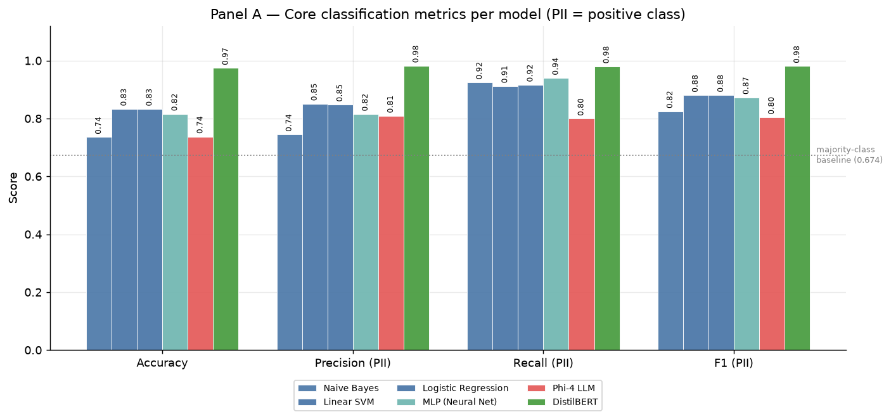

# Tuned for the Track

## Detecting Privacy-Sensitive Prompts Before They Reach an External LLM

External large language models create a new path for accidental data disclosure: a user can paste personally identifiable information (PII) into a prompt before an organization has a chance to detect it. This project evaluates whether a local screening model can classify prompt text as **safe** or **privacy-sensitive** before submission.

We compare classical machine learning, a neural network, multilingual DistilBERT, and a locally hosted Phi-4 baseline to determine whether a purpose-built classifier can provide strong PII detection with response times suitable for an interactive workflow.

> **Core finding:** On the same 3,000 prompts, multilingual DistilBERT achieved a PII F1 of **0.979**, compared with **0.804** for Phi-4, while averaging **2.4 ms** per prompt versus **688.8 ms** for Phi-4.

## Final Deliverables

- [Final Project Notebook](notebooks/00_Prompt_Privacy_Screening.ipynb)
- [Final Presentation - View as PDF](docs/CYBER207_Tuned_for_the_Track_Final_Presentation.pdf)
- [Final Presentation - Download PowerPoint](docs/CYBER207_Tuned_for_the_Track_Final_Presentation.pptx)

## Research Question

How accurately and efficiently can specialized machine learning models classify text as safe or privacy-sensitive before it is submitted to an external LLM, and how do their detection performance and response times compare with a general-purpose LLM baseline?

## Project Approach

The [AI4Privacy PII-Masking-400k dataset](https://huggingface.co/datasets/ai4privacy/pii-masking-400k) provides multilingual text with token-level PII annotations. We converted those annotations into a document-level screening decision:

- **Safe (`0`)**: no token is labeled as PII
- **Privacy-sensitive (`1`)**: at least one token is labeled as PII

After removing blank and duplicate text, the final dataset contained **325,423 examples**:

- 219,260 privacy-sensitive examples (67.4%)
- 106,163 safe examples (32.6%)

The data was split into frozen, stratified train, validation, and test sets using an 80/10/10 split with seed 42. All specialized models were evaluated on the same 32,543-row test set. Phi-4 was evaluated on a stratified 3,000-row subset because of its substantially slower local inference time, and DistilBERT was also evaluated on those exact 3,000 prompts for a controlled comparison.

## Models Compared

| Model family | Models | Representation |
|---|---|---|
| Classical machine learning | Logistic Regression, Naive Bayes, Linear SVM | TF-IDF and engineered features |
| Neural network | Multilayer Perceptron (MLP) | Same combined feature matrix |
| Fine-tuned transformer | Multilingual DistilBERT | Subword tokens and contextual representations |
| General-purpose LLM baseline | Phi-4 14B via Ollama | Zero-shot structured prompt |

## Feature Engineering

The classical models and MLP used a **50,018-column combined feature matrix** consisting of:

- 50,000 unigram and bigram TF-IDF features
- 10 text-structure features, including length, word count, digit ratio, and punctuation patterns
- 8 privacy-pattern features for structures such as email addresses, phone numbers, URLs, IP addresses, and long numeric identifiers

A controlled feature ablation showed that the combined feature set improved Logistic Regression PII F1 from **0.868 to 0.881** over the same 50,000-feature TF-IDF baseline. This confirmed that the engineered features added useful signal beyond the vocabulary representation alone.

## Results

### Full Held-Out Test Set

| Model | PII precision | PII recall | PII F1 | False negatives |
|---|---:|---:|---:|---:|
| Logistic Regression | 0.848 | 0.916 | 0.881 | 1,841 |
| Naive Bayes | 0.744 | 0.925 | 0.825 | 1,650 |
| Linear SVM | 0.851 | 0.912 | 0.880 | 1,931 |
| MLP | 0.815 | 0.940 | 0.873 | 1,324 |
| **Multilingual DistilBERT** | **0.982** | **0.980** | **0.981** | **447** |

All models in this table were evaluated on the frozen 32,543-row test set. Because missed PII represents the primary privacy risk, PII recall and F1 were emphasized over accuracy alone.



### Controlled DistilBERT vs. Phi-4 Comparison

| Model | PII precision | PII recall | PII F1 | Macro F1 | False positives | False negatives |
|---|---:|---:|---:|---:|---:|---:|
| **DistilBERT** | **0.979** | **0.980** | **0.979** | **0.968** | **43** | **41** |
| Phi-4 | 0.809 | 0.799 | 0.804 | 0.703 | 382 | 406 |

Both models were evaluated on the exact same 3,000 prompts. DistilBERT produced substantially stronger precision and recall while running approximately **287 times faster** in the project’s single-prompt latency benchmark.

## Key Findings

- A smaller model trained for the specific task outperformed the much larger general-purpose LLM baseline.
- Multilingual DistilBERT provided the strongest balance of PII detection and false alarms.
- Logistic Regression remained a credible, CPU-friendly alternative with a PII F1 of 0.881.
- The recall-focused MLP missed fewer PII examples than the classical models, but its additional false positives would create more user friction.
- Phi-4’s errors were sensitive to prompt wording and masking placeholders. A targeted prompt revision reduced false positives from 547 to 382, but increased false negatives from 326 to 406.
- Model fit mattered more than model size for this narrow document-level screening task.

## Repository Structure

```text
notebooks/          Final notebook and supporting analysis notebooks
notebooks/figures/  Evaluation and comparison figures
src/                Data, feature, model, and evaluation code
data_splits/        Frozen train, validation, and test splits
feature_matrices/   Saved sparse feature matrices
results/            Metrics, predictions, ablations, and latency results
docs/               Decision log, model analysis, and final presentation
```

## Reproducing the Analysis

The fastest way to review the complete project is to open the [final notebook](notebooks/00_Prompt_Privacy_Screening.ipynb) in Google Colab and run the cells from top to bottom.

For a local environment:

```bash
git clone https://github.com/Cyber-207/cyber207_specialized_PII_detection_comparison.git
cd cyber207_specialized_PII_detection_comparison
git lfs pull

python3 -m venv cyber207_env
source cyber207_env/bin/activate
pip install -r requirements.txt
pip install jupyter

python3 src/data/data_split.py
jupyter notebook
```

The final notebook assembles the committed project results and figures. Re-training every model requires the model-specific setup documented in the supporting notebooks. DistilBERT training benefits from a CUDA-capable GPU, while the Phi-4 baseline requires a local Ollama installation.

## Limitations

- The dataset contains synthetic and masked text that may not fully represent real employee prompts.
- The target label covers dataset-annotated PII, not all sensitive information such as credentials, source code, trade secrets, or confidential strategy.
- Some examples labeled safe contain identifiers that appear sensitive, creating ground-truth ambiguity.
- Phi-4’s prompt revision was developed after reviewing errors from its evaluation subset and should be validated on untouched data.
- Latency results depend on the project’s local hardware and software configuration.
- Production use would require organization-specific validation, threshold calibration, monitoring, and broader sensitive-data coverage.

## Team

This project was completed for **UC Berkeley CYBER 207: AI/ML in Cybersecurity, Summer 2026**.

- **Aura Gaines** - data preparation, feature engineering, and primary notebook narrative
- **Alan Jiang** - classical machine learning and neural network modeling
- **Brandon Shumack** - multilingual DistilBERT and Phi-4 baseline
- **Fil Dziembowski** - exploratory data analysis, evaluation, error analysis, and integration
